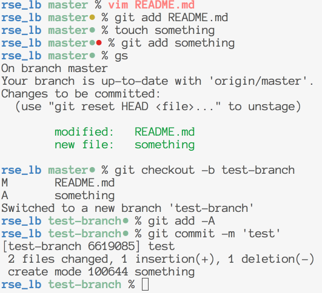

build-lists: true
# Building Your Own Tools

### Jason Draper
### @drapergeek
### thoughtbot

---

# Who am I?

* Developer
* Father
* General Geek
* Avid wakeboarder

---


# Who is thoughtbot?

* Build fun stuff for clients
* Apprentice program
* Upcase
* Investment time

---
# What are dotfiles?

* Really? They're just hidden files
* In our case - they're configuration files
* They are what makes each developer's setup unique

---
# Cool, can you be a bit more specific?

* shell configuration
* text editors
* Git

---

# Shell stuff
## Custom Prompts


---

# Shell stuff
## Custom Prompts


---

# Shell stuff
## Custom Prompts



---
# Shell stuff
## History
* change your history length
* set your history to go across multiple terminals

---
# Shell stuff

* Set ENV information - your name and/or email

```bash
export NAME='Jason Draper'
export EMAIL='jason@drapergeek.com'
```
---

# Git
* Set your name and email!
* Set preferences on merging and pushing branches
* Add quick commands for common things

```bash
git uf # git reset --hard HEAD
git rc # git rebase --continue
git dm # git diff master
git done # merge the to master and push to origin
```

---

# Aliases

## Type less, do more!

```bash
$ d
$ c
$ g
$ gi
$ s
$ fs
$ m
```

---

# Vim

## Make common things easier

```vim
map <silent> <F5> mmgg=G'm "Fix entire file indentation
nnoremap <leader><leader> <c-^> "Switch between the last two files
```

## Encourage good habits

```vim
map <Leader>v :vsp ~/.vimrc<CR> "Open my vim config
map <Leader>s :vsp ~/.aliases<CR> "Open my aliases file
```

---

# Why does this matter?

* Efficiency!
* Can help you learn
* Simplify your life

---

## Why does this REALLY matter?

* It's an extension of your craft
* Take pride in your job, take pride in your tools
* Continuously improve your process
* Let's not kid ourselves - it's awesome

---
# How do I start?

* Find a base set of dotfiles
  * http://github.com/thoughtbot/dotfiles
  * https://dotfiles.github.io/
  * https://github.com/holman/dotfiles
